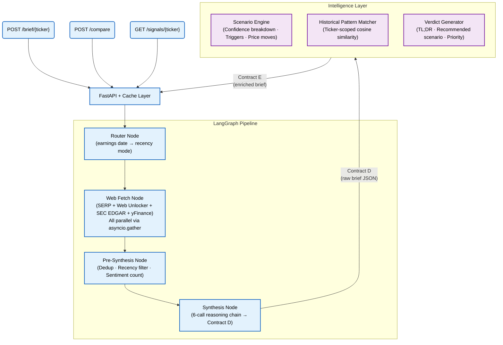

# EarningsEdge

> **Bright Data AI Builder Weekend** · Track 2: Finance & Market Intelligence
>
> Autonomous pre-earnings intelligence platform. Ticker in — grounded multi-layer
> brief out. Three data sources, six LLM calls, one analyst-grade output.

---

## What It Does

**Input:** Stock ticker — `NVDA`, `TSLA`, `AMD`

**Output:** Three-layer intelligence package in under 37 seconds:

```
Layer 1 — Raw Brief
  Bull signals, bear signals, risk flags
  Grounded in live web data + SEC 10-Q filings + quantitative consensus
  Source-cited with authority scores (SEC filing = 1.0, transcript = 0.95)
  Contradiction-resolved — CEO quote beats Reuters every time

Layer 2 — Scenario Engine
  Bull / Base / Bear cases with confidence breakdown
  Confidence from signal counting + authority weighting, not LLM gut feel
  Key triggers per scenario + expected price move ranges
  Overall verdict with TL;DR and watchlist priority

Layer 3 — Historical Pattern Match
  2–3 most similar past pre-earnings setups
  "This setup resembles Q2 2023 TSLA — stock gapped +24% post-earnings"
  Ticker-scoped similarity over stored historical briefs
```

**Demo:**
- NVDA brief from cache: **< 20ms**
- NVDA vs AMD comparison from cache: **< 20ms**
- Any live ticker (e.g. MSFT): **< 37 seconds**

---

## Architecture



---

## The 6-Call Reasoning Chain

What separates EarningsEdge from a wrapper: before the LLM writes a single word, the pipeline runs a full contradiction audit.

```
Call 0 → Contradiction Detection
         Compares every chunk pair — finds interpretive conflicts,
         numerical discrepancies, guidance vs analyst disagreements

Call 1 → Classification
         Labels each chunk: bull / bear / risk / neutral / contradicted
         Receives known contradiction pairs from Call 0 — only needs to classify

Call 2 → Contradiction Resolution
         Authority hierarchy: SEC filing (1.0) > transcript (0.95) > tier-1 news (0.85)
         CEO direct quote beats anonymous source. Every time.

Call 3 → Draft Sections
         Writes bull, bear, risk sections independently
         Quantitative rules: PEG < 1.0 = bull signal. Short interest < 5% = bull signal.
         yFinance context injected — "$2.08 consensus EPS" not "analysts expect growth"

Call 4 → Coherence Check (conditional)
         Skipped if no overlap between bull/bear sections — saves 4-5 seconds
         Only fires if the same fact appears in both sections

Call 5 → Format to Contract D
         Strict JSON schema with source attribution
         brief_id and generated_at set in Python — LLM never touches them
```

---

## Data Sources — Three in Parallel

| Source | What It Gives | Authority | How |
|--------|--------------|-----------|-----|
| **Bright Data SERP API** | Top news URLs for the ticker | 0.65–0.85 | Live search per request |
| **Bright Data Web Unlocker** | Full article content (not just snippets) | 0.65–0.85 | Fetches top 2 URLs fully |
| **SEC EDGAR** | Most recent 10-Q / 10-K filing | **1.0** | Free public API, no key needed |
| **yFinance** | Consensus EPS, Forward P/E, PEG, price targets, earnings surprise history | 0.90 | Pre-labeled chunks injected directly |

All four run in parallel via `asyncio.gather`. The pipeline never waits for one source before starting another.

---

## Resilience — What Happens When Things Break

```
Bright Data returns 502?
  → Exponential backoff retry (3 attempts)
  → If still failing: yFinance + SEC chunks carry the brief

Web fetch returns < 5 chunks?
  → Demo tickers (NVDA/TSLA/AMD): serve cache transparently
  → Other tickers: run synthesis on available chunks with data_quality flag

Cache miss on demo ticker?
  → Live pipeline runs automatically
  → Result cached after completion

Every response includes:
  "data_quality": {
    "status": "healthy" | "degraded",
    "web_chunks_fetched": 14,
    "cached_at": null | "iso-timestamp"
  }
```

---

## Data Contracts

### Contract D — Raw Brief (Pipeline → Intelligence Layer)

```json
{
  "ticker": "NVDA",
  "brief_id": "uuid",
  "generated_at": "iso-timestamp",
  "bull_signals": [
    {"text": "string", "source_id": "uuid", "source_type": "filing|news|transcript"}
  ],
  "bear_signals": [
    {"text": "string", "source_id": "uuid", "source_type": "string"}
  ],
  "risk_flags": [
    {"text": "string", "source_id": "uuid", "source_type": "string"}
  ],
  "analyst_sentiment": "bullish|neutral|bearish",
  "comparable_quarter": "Q2 2023",
  "sources": [
    {"id": "uuid", "url": "string", "type": "string", "date": "iso", "authority": 1.0}
  ],
  "contradictions_resolved": [
    {"chunk_a": "id", "chunk_b": "id", "claim_a": "string", "claim_b": "string", "resolution": "string"}
  ],
  "data_quality": {
    "status": "healthy|degraded",
    "web_chunks_fetched": 14,
    "yfinance_chunks": 6,
    "sec_chunks": 6
  }
}
```

### Contract E — Enriched Brief (Intelligence Layer → API)

```json
{
  "verdict": {
    "tldr": "Strong bull case driven by Blackwell demand. Setup resembles Q2 2023 which saw +28%.",
    "recommended_scenario": "bull",
    "confidence_level": "high",
    "watchlist_priority": "top"
  },
  "scenarios": {
    "bull": {
      "summary": "analyst prose — not copy-pasted signal text",
      "confidence": 0.89,
      "confidence_breakdown": {"raw_signal_ratio": 0.72, "authority_adjustment": "+0.08"},
      "drivers": ["string"],
      "triggers": ["Blackwell shipments exceed 100K units in guidance"],
      "expected_move": {"range_low": "+8%", "range_high": "+28%", "based_on": "historical_matches"}
    }
  },
  "historical_matches": [
    {
      "quarter": "Q2 2023",
      "ticker": "NVDA",
      "similarity_score": 0.92,
      "outcome": "Stock gapped up 24% post-earnings",
      "return_5d": "+28.4%",
      "key_similarity_factors": ["Architecture transition", "Data center demand surge"]
    }
  ]
}
```

---

## API Endpoints

```bash
# Full enriched brief — cache-first
POST /brief/{ticker}?use_cache=true

# Two tickers in parallel
POST /compare
Body: {"tickers": ["NVDA", "AMD"]}

# Signals only — lightweight
GET /signals/{ticker}

# Demo readiness check
GET /cache/status

# Health
GET /health
```

---

## Parallelization

```mermaid
gantt
    title Pipeline Timeline (~37s live · <20ms cached)
    dateFormat  mm:ss
    axisFormat  %M:%S

    section Parallel Fetch
    SERP API                :a1, 00:00, 8s
    Web Unlocker (articles) :a2, 00:00, 12s
    SEC EDGAR 10-Q          :a3, 00:00, 8s
    yFinance                :a4, 00:00, 4s

    section Pre-Synthesis
    Dedup + Recency + Sentiment :a5, 00:12, 2s

    section 6-Call Chain
    Call 0 Contradiction detect :a6, 00:14, 5s
    Call 1 Classify             :a7, 00:19, 3s
    Call 2 Resolve              :a8, 00:22, 4s
    Call 3 Draft sections       :a9, 00:26, 6s
    Call 5 Format               :a10, 00:32, 3s

    section Intelligence
    Scenario + Pattern + Verdict :a11, 00:35, 5s
```

---

## Stack

```
Frontend         React, Vite, Tailwind CSS v4, GSAP, Lenis, Framer Motion
Backend          FastAPI, Python 3.11+
Agent            LangGraph
LLM              Llama 3.3 70B Instruct Turbo via AI/ML API (free tier)
Data             Bright Data (SERP API + Web Unlocker)
                 SEC EDGAR (free public API)
                 yFinance (quantitative grounding)
Cache            JSON file cache (api/cache_data/)
Infrastructure   No Docker — runs locally or on any Python host
```

---

## Bright Data Tools

| Tool | Used For |
|------|---------|
| **SERP API** | Live news search per ticker — finds top URLs |
| **Web Unlocker** | Full article content fetch — not just snippets |

---

## Quick Start

### 1. Backend Setup

```bash
git clone https://github.com/your-team/earningsedge
cd earningsedge
pip install -r requirements.txt

cp .env.example .env
# BRIGHT_DATA_API_KEY=
# BRIGHT_DATA_SERP_ZONE=serp_api
# BRIGHT_DATA_UNLOCKER_ZONE=web_unlocker
# BRIGHT_DATA_SERP_URL=https://api.brightdata.com/request
# BRIGHT_DATA_UNLOCKER_URL=https://api.brightdata.com/request
# OPENAI_API_KEY=        ← your AI/ML API key
# OPENAI_BASE_URL=https://api.aimlapi.com/v1
# GROQ_API_KEY=          ← optional fallback

# Pre-populate cache for demo tickers
PYTHONPATH=. python api/cache.py

# Start API
PYTHONPATH=. uvicorn api.main:app --reload --port 8000
```

### 2. Frontend Setup

```bash
# In a new terminal window
cd frontend
npm install
npm run dev
```

Visit `http://localhost:5173` to view the UI.