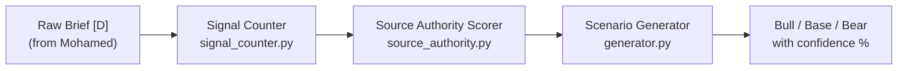
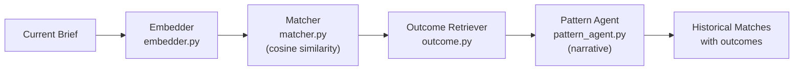

# Adil's Plan — Intelligence Amplifier (EarningsEdge)

## What is EarningsEdge?

EarningsEdge is a **pre-earnings intelligence platform** built for the Bright Data AI Builder Weekend (Finance & Market Intelligence track). You give it a stock ticker (e.g. `NVDA`), and it returns a multi-layered analyst-grade brief — all autonomously, in under 35 seconds.

The project is built by **3 people**, each owning a distinct layer:

| Team Member | Layer | Role |
|-------------|-------|------|
| **Ilyas** | Data Nervous System | Scrapes, cleans, and embeds raw data (SEC filings, transcripts, news, hiring signals) into Supabase |
| **Mohamed** | Retrieval Brain & Agent | LangGraph agent that retrieves data, resolves contradictions, and synthesizes a raw analyst brief |
| **Adil** | Intelligence Amplifier | Takes Mohamed's raw brief and enriches it with scenario analysis + historical pattern matching |

---

## Where Adil Fits in the Pipeline

```
Ilyas (data) ──→ Mohamed (agent + synthesis) ──→ Adil (intelligence) ──→ Final Output
                                  │                        │
                            Produces [D]            Produces [E]
                          (Raw Brief JSON)       (Enriched Brief JSON)
```

Adil's code runs **after** Mohamed's synthesis is complete. He receives the **Raw Brief [D]** as input and returns the **Enriched Brief [E]** as output. His code makes **zero extra web calls** — it operates entirely on stored data and the brief Mohamed already produced.

---

## Adil's Two Core Components

### 1. 🎯 Scenario Engine — Bull / Base / Bear Analysis

**Goal:** Generate three investment scenarios (Bull, Base, Bear) with **mathematically grounded confidence scores**.

> [!IMPORTANT]
> The key design principle: **confidence scores must be derived from a formula, not generated by an LLM**. An LLM saying "65% confidence" is not defensible. A formula based on signal counting + source weighting **is**.

#### How it works:



**Step-by-step:**

1. **`signal_counter.py`** — Counts and categorizes bull vs. bear signals from the raw brief
2. **`source_authority.py`** — Weights each source by two factors:
   - **Type authority** (filing = 1.4, transcript = 1.2, news = 0.9, hiring = 0.8) — SEC filings outweigh news articles
   - **Recency decay** (exponential decay with a 30-day half-life) — newer sources matter more
3. **`generator.py`** — Combines weighted signals to produce three scenarios with summaries, drivers/risks, and confidence percentages
4. **`engine.py`** — Wires the three components together into one callable pipeline

#### The Confidence Formula:

```python
def compute_confidence(brief, sources):
    bull_count = len(brief["bull_signals"])
    bear_count = len(brief["bear_signals"])
    total = bull_count + bear_count + 1e-9  # avoid division by zero

    raw_bull = bull_count / total
    raw_bear = bear_count / total

    # Apply authority weights (filing > transcript > news > hiring)
    # Apply recency decay (30-day half-life exponential)
    bull_conf = weighted_adjust(raw_bull, authority_weights, recency_weights)
    bear_conf = weighted_adjust(raw_bear, authority_weights, recency_weights)
    base_conf = 1 - bull_conf - bear_conf  # always sums to 1.0

    return {"bull": bull_conf, "base": base_conf, "bear": bear_conf}
```

---

### 2. 📊 Historical Pattern Matcher — "This Looks Like Q2 2023"

**Goal:** Find 2–3 past pre-earnings setups that are most similar to the current situation and show what happened after those quarters.

#### How it works:



**Step-by-step:**

1. **`embedder.py`** — Embeds the current brief into a vector for similarity search
2. **`matcher.py`** — Runs cosine similarity against historical briefs stored in Supabase (pgvector)
3. **`outcome.py`** — For each matched historical setup, retrieves what actually happened (stock moved +X%, beat/miss, etc.)
4. **`pattern_agent.py`** — Wires the full flow: match → outcome → human-readable narrative

> [!NOTE]
> **Cold-start problem:** On day one, the database has no historical briefs. Adil solves this by **manually writing 4-6 historical brief JSONs** for NVDA/AMD from past quarters and inserting them into Supabase before the demo.

---

## Files Adil Owns

| File | What It Does |
|------|-------------|
| `intelligence/enricher.py` | **Main orchestrator** — runs both the Scenario Engine and Pattern Agent, returns the complete Enriched Brief [E] |
| `intelligence/scenario/signal_counter.py` | Counts + categorizes bull/bear signals from the raw brief |
| `intelligence/scenario/source_authority.py` | Scores sources by type × recency (exponential decay) |
| `intelligence/scenario/generator.py` | Generates Bull / Base / Bear scenarios from weighted signals |
| `intelligence/scenario/engine.py` | Wires counting → weighting → generation into one call |
| `intelligence/history/embedder.py` | Embeds the current brief for vector similarity search |
| `intelligence/history/matcher.py` | Cosine similarity over historical briefs in Supabase |
| `intelligence/history/outcome.py` | Retrieves stored outcomes for each matched historical setup |
| `intelligence/history/pattern_agent.py` | Full pipeline: match → outcome → narrative |

---

## Data Contracts

### What Adil Receives — [D] Raw Brief (from Mohamed)

```json
{
  "ticker": "NVDA",
  "brief_id": "uuid",
  "generated_at": "iso-timestamp",
  "bull_signals": [
    {"text": "...", "source_id": "uuid", "source_type": "filing|news|transcript"}
  ],
  "bear_signals": [
    {"text": "...", "source_id": "uuid", "source_type": "string"}
  ],
  "risk_flags": ["string"],
  "analyst_sentiment": "bullish|neutral|bearish",
  "comparable_quarter": "string",
  "sources": [
    {"id": "uuid", "url": "string", "type": "string", "date": "iso", "authority": 0.9}
  ],
  "contradictions_resolved": [
    {"claim_a": "string", "claim_b": "string", "resolution": "string"}
  ]
}
```

### What Adil Returns — [E] Enriched Brief (to Mohamed)

```json
{
  "scenarios": {
    "bull":  {"summary": "...", "confidence": 0.65, "drivers": ["..."]},
    "base":  {"summary": "...", "confidence": 0.25, "drivers": ["..."]},
    "bear":  {"summary": "...", "confidence": 0.10, "risks":   ["..."]}
  },
  "historical_matches": [
    {
      "quarter": "Q2 2023",
      "similarity_score": 0.92,
      "setup_summary": "Similar transition period...",
      "outcome": "Stock gapped up 24% post-earnings...",
      "return_5d": "+28.4%"
    }
  ]
}
```

---

## Adil's 5-Phase Roadmap

### Phase 1: Foundation 🏗️
- Read and lock Mohamed's schema [D]
- Build `enricher.py` stub — accepts [D], returns [E] with **mock data** (so Mohamed can integrate immediately)
- Implement `signal_counter.py` — count bull/bear from brief signals

### Phase 2: Core Implementation ⚙️
- Build `source_authority.py` — source type scoring + recency decay
- Implement the confidence formula (signal count × authority weight)
- Build `generator.py` — generate the three scenarios from weighted signals
- **Test** the full Scenario Engine on the mock [D] JSON

### Phase 3: Integration 🔗
- Build `history/embedder.py` — embed the current brief
- **Write 4–6 mock historical brief JSONs** for NVDA/AMD and seed them into Supabase (cold-start fix)
- Build `history/matcher.py` — cosine similarity search over historical briefs DB
- Build `history/outcome.py` — retrieve stored outcomes per match
- Build `pattern_agent.py` — wire match → outcome → narrative
- **Test** pattern matcher on 2 pre-loaded historical briefs

### Phase 4: Full Pipeline 🔄
- Wire `enricher.py` to run both `scenario_engine` + `pattern_agent` → produce complete [E]
- Integration test with Mohamed's **live** brief output
- Handle edge case: < 3 historical briefs in DB → graceful fallback
- Validate [E] schema matches what Mohamed expects

### Phase 5: Polish & Demo Prep ✨
- Confidence score sanity check — do percentages always sum to 1.0?
- Historical match quality check — tune similarity threshold
- Handle edge case: ticker with no historical briefs → skip cleanly
- **End-to-end test**: raw brief in → enriched brief out in **< 12 seconds**

---

## Adil's Role in the Hackathon Timeline

| Time Block | What Adil Does |
|------------|---------------|
| **Friday Night (H0–6)** | Build the Scenario Engine formulas on mock data. Write 3–4 historical brief JSONs for NVDA/AMD to seed the DB |
| **Saturday Afternoon (H16–28)** | Wire `pattern_agent` to query Supabase for historical briefs. Connect `enricher.py` to Mohamed's output |
| **Saturday Night (H28–36)** | Add quantitative grounding (yFinance/Polygon) to adjust confidence scores |
| **Sunday Morning (H36–48)** | Polish, edge cases, and demo prep |

---

## Key Design Decisions

1. **Formula-based confidence, not LLM-generated** — This is the core differentiator. A judge can ask "where does 65% come from?" and Adil can point to the formula
2. **Zero extra web calls** — Adil's layer runs purely on stored data + Mohamed's brief, keeping latency low
3. **Mock-first development** — Everything is tested on mock data before wiring to real pipeline
4. **Graceful degradation** — If there are < 3 historical briefs or no data for a ticker, the system returns a clean fallback instead of crashing

> [!TIP]
> **Future enhancement mentioned in the project:** Add a yFinance/Polygon API call to pull hard numbers (Consensus EPS, Forward P/E) and inject them into the Scenario Engine for even more mathematically grounded confidence scores.
